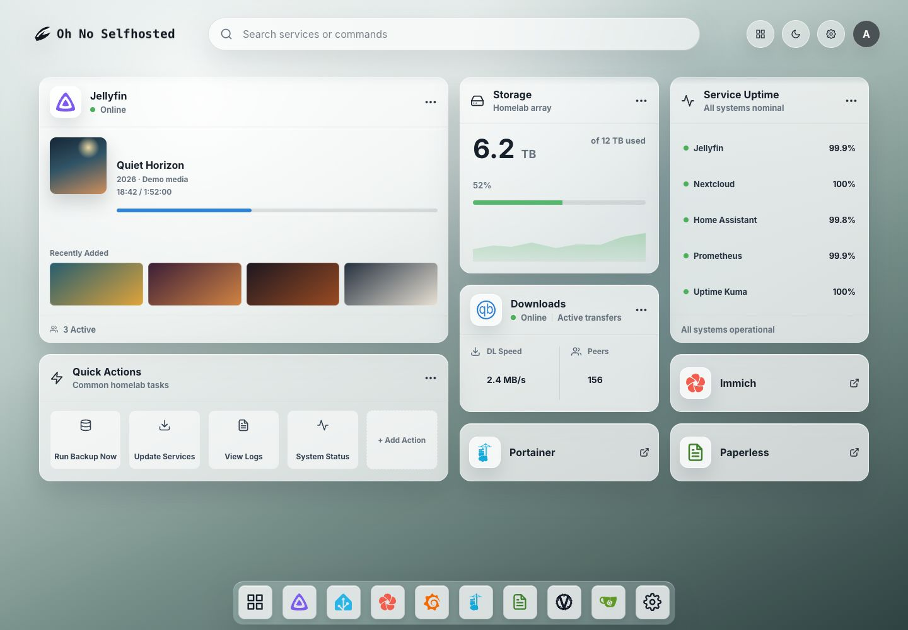

# Oh No Selfhosted

A local-first dashboard for homelab services, widgets, integrations, and trusted extensions.



_Dashboard shown with isolated demo data._

The project is pre-1.0. It is suitable for local evaluation and contribution, but configuration and plugin contracts may still change between releases.

## Highlights

- Responsive service launcher and widget canvas.
- Local SQLite persistence with no hosted control plane.
- Built-in adapters for common self-hosted services.
- User-managed backgrounds and service icons.
- A documented plugin registry and SDK for service types, widgets, adapters, and integrations.
- macOS LaunchAgent and Linux user-systemd installation through the npm CLI.

## Security model

The production server binds to `127.0.0.1` by default and does not include user authentication. Do not expose port `8787` directly to the public internet.

For access from another device, put the application behind a reverse proxy that provides TLS and authentication. Treat every user who can reach the application as an administrator: they can change services, widgets, and local configuration.

External server plugins execute with the same operating-system permissions as the dashboard. They are disabled by default. Enabling them requires the explicit `--allow-unsafe-plugins` option or `ALLOW_UNSAFE_PLUGINS=true`. Review the complete source of every plugin before installation.

See [SECURITY.md](SECURITY.md) for the threat model and vulnerability reporting process.

## Requirements

- Node.js 22.5 or newer; current Node 22 and 24 releases are tested in CI.
- npm 10 or newer.
- macOS or Linux for managed background-service commands. Other platforms can run the source project with `npm start`.

## Run from source

```bash
cd prototype
npm ci
npm run dev
```

Open `http://127.0.0.1:5173`.

Production-style local run:

```bash
cd prototype
npm ci
npm run build
npm start
```

Open `http://127.0.0.1:8787`.

## Install from npm

Install the CLI directly from npm:

```bash
npm install --global oh-no-selfhosted
```

Then configure auto-start and launch the background service:

```bash
oh-no-selfhosted setup
oh-no-selfhosted start
```

`setup` writes and enables the macOS LaunchAgent or Linux user-systemd definition without starting it immediately. It writes the complete managed-service configuration, including the listen address, port, data and log directories, service label, package runtime path, and unsafe-plugin setting. Running `setup` again replaces that definition using the options and environment variables supplied to the new command; omitted values return to their defaults rather than preserving the previous definition. Run `restart` after reconfiguring a running service, or `start` if it is stopped.

`start`, `stop`, and `restart` always manage the background service; none of them runs the server in the current terminal. Service registration is not hidden in a package `postinstall` side effect, which npm 12 blocks by default for global packages unless separately approved.

The managed service binds to loopback and stores persistent data outside the npm package. Avoid running the installer through `npx`: npm's temporary execution cache is not a stable service location.

Useful commands:

```bash
oh-no-selfhosted setup
oh-no-selfhosted start
oh-no-selfhosted stop
oh-no-selfhosted status
oh-no-selfhosted restart
oh-no-selfhosted update
oh-no-selfhosted remove
```

`remove` stops the managed service, disables auto-start, removes its service definition, and uninstalls the global npm package. User data is kept. Running `npm uninstall --global oh-no-selfhosted` directly is safe only if `setup` was never used; otherwise it leaves a stale LaunchAgent or systemd unit behind.

`update` installs the latest npm release and restarts the managed service only if it was already running. For a package-only update, use `oh-no-selfhosted update --no-restart`.

### Local-network access

The default `127.0.0.1` address accepts connections only from the host machine. To make the dashboard available to devices on a trusted local network, rewrite the managed-service definition to listen on all IPv4 interfaces and then apply it:

```bash
oh-no-selfhosted setup --host 0.0.0.0 --port 8787
oh-no-selfhosted restart
```

If you use a non-default data directory, label, log directory, or unsafe-plugin setting, include those options again when rerunning `setup`. Open `http://<host-lan-ip>:8787` from another device. This application has no built-in user authentication, so do not expose port `8787` directly to the public internet; use an authenticated TLS reverse proxy for access outside a trusted LAN.

## Build and install a local package

For an unreleased checkout, verify and install the local tarball:

```bash
cd prototype
npm ci
npm run pack:check
npm run pack:local
npm install -g ./oh-no-selfhosted-0.1.4.tgz
oh-no-selfhosted setup
oh-no-selfhosted start
```

## Configuration

| Option / environment variable | Default | Purpose |
|---|---:|---|
| `--host`, `HOST` | `127.0.0.1` | Listen address. Use `0.0.0.0` only on a trusted LAN, or use a reverse proxy. |
| `--port`, `PORT` | `8787` | HTTP port. |
| `--data-dir`, `DATA_DIR` | platform data directory | SQLite database, installed plugins, uploads, and caches. |
| `--log-dir`, `OH_NO_SELFHOSTED_LOG_DIR` | platform log directory | Managed-service stdout and stderr logs. |
| `--label`, `OH_NO_SELFHOSTED_LABEL` | `com.oh-no-selfhosted` | LaunchAgent label or basis of the systemd unit name. |
| `--allow-unsafe-plugins`, `ALLOW_UNSAFE_PLUGINS` | `false` | Allow unsandboxed external server plugins. |
| `STATIC_DIR` | package `dist/` | Built frontend directory. |
| `SERVE_STATIC` | `true` | Serve the frontend from the API process. |
| `INTEGRATION_PLUGIN_DIRS` | empty | Additional integration roots; used only when external plugins are enabled. |
| `WIDGET_PLUGIN_DIRS` | empty | Additional widget roots; used only when external plugins are enabled. |

The application does not automatically load `.env` files. Export variables in the shell or configure them in the process manager/reverse proxy.

## Data

Runtime data is ignored by Git. From a source checkout it defaults to `prototype/data/`; package installations use the platform application-data directory. The data directory is created with user-only permissions on macOS and Linux.

Service credentials and private registry tokens are sensitive. They are never returned by the public API, but are stored locally for adapters that need them. Back up and protect the data directory accordingly.

## Plugins

Built-in packages use the same manifest contracts as external packages. External server and React plugin code is intentionally unsandboxed and must be treated like software installed directly on the host.

See [the plugin registry guide](prototype/docs/plugin-registry.md) and the complete [example registry](prototype/examples/plugin-registry/).

## Verification

```bash
cd prototype
npm test
npm run build
npm run test:layout
npm run plugin:validate -- ./builtins
npm run plugin:validate -- ./examples/plugin-registry
npm run pack:check
npm run publish:check
```

## Repository layout

```text
prototype/
  bin/          CLI and service manager
  builtins/     generated built-in registry
  docs/         plugin contract documentation
  examples/     example plugin registry
  plugin-sdk/   JSON schemas
  scripts/      build and verification tools
  server/       local API, storage, and plugin runtimes
  src/          React application
```

See [CONTRIBUTING.md](CONTRIBUTING.md) before opening a pull request.

## License

Licensed under the [Apache License 2.0](LICENSE). Third-party notices are listed in [THIRD_PARTY_NOTICES.md](THIRD_PARTY_NOTICES.md).
